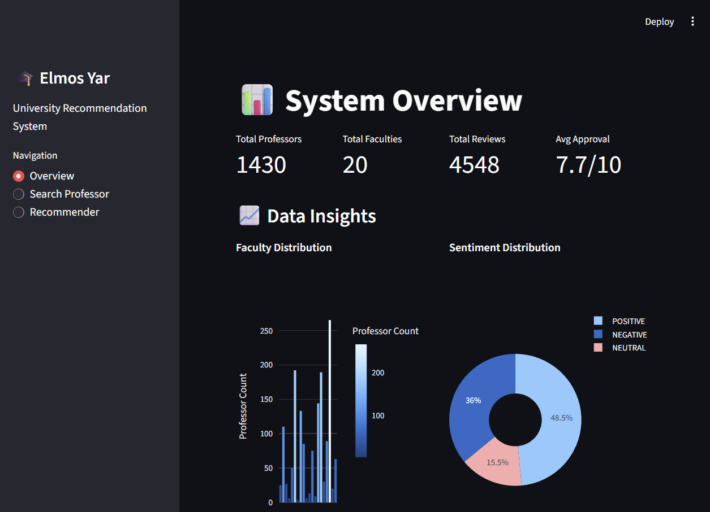

# Elemos Yar (علموص یار) - Intelligent Professor Analysis System



## 🌟 Project Overview
**Elemos Yar** is an advanced data analytics platform designed to empower university students with data-driven insights for course selection. By analyzing unstructured student reviews from Telegram channel, the system builds comprehensive professor profiles, predicts approval ratings, and provides personalized recommendations.

The core innovation lies in its ability to process informal Persian text (Finglish, slang, typos) and extract structured metrics about **Teaching Quality**, **Grading Fairness**, and **Attendance Policies** without requiring manual labeling.

---

## 📂 Project Architecture
The codebase is structured for scalability and modularity:

```text
d:\personal\Projects\علموص یار\
├── app.py                      # 🚀 Main Streamlit Web Application
├── recommender_system.py       # 🧠 Core Recommendation Engine Class
├── README.md                   # 📄 Project Documentation (You are here)
├── data/                       # 💾 Data Storage Layer
│   ├── raw/                    # Raw Input Data
│   │   └── result.json         # Raw Telegram Export
│   ├── processed/              # Intermediate Processed Data
│   │   ├── processed_comments.json # Parsed & Cleaned JSON
│   │   └── normalized_comments.json # Enriched Dataset with Features & Sentiment
│   └── output/                 # Final Outputs
│       ├── professor_approval_ratings.csv # Generated Leaderboard
│       └── professor_clusters.json # ML Cluster Assignments
├── scripts/                    # 🛠️ ETL & Analysis Pipeline
│   ├── process_data.py         # ETL: Raw JSON Parser
│   ├── normalize_data.py       # NLP: Persian Text Normalization
│   ├── sentiment_analysis.py   # AI: BERT-based Sentiment Scoring
│   ├── extract_features.py     # NLP: Rule-based Feature Extraction
│   ├── binary_classifier.py    # ML: Approval Prediction Model
│   ├── calculate_approval.py   # Stats: Approval Rating Aggregation
│   └── professor_clustering.py # ML: Unsupervised Clustering (K-Means)
├── models/                     # 🤖 Trained Model Artifacts
│   └── binary_classifier_model.pkl
└── images/                     # 📊 Generated Static Plots
    └── professor_clusters_plot.png
```

---

## 🧠 Algorithms & Models Explained

### 1. 📝 Natural Language Processing (NLP) Pipeline
Before any analysis, we clean the raw Persian text to ensure consistency:
*   **Normalization**: We use `unicodedata` and custom regex to standardize Arabic/Persian characters (e.g., `ي` -> `ی`, `ك` -> `ک`).
*   **Digit Unification**: All numbers (Persian `۱۲۳` or Arabic `١٢٣`) are converted to English `123`.
*   **Entity Resolution**: Professor names are stripped of titles (Dr., Eng., Ostad) to merge duplicates (e.g., "Dr. Akbari" == "Akbari").

### 2. 🎭 Sentiment Analysis (Transfer Learning)
Instead of training a sentiment model from scratch, we employ **Transfer Learning**:
*   **Model Architecture**: BERT (Bidirectional Encoder Representations from Transformers).
*   **Pre-trained Weights**: `HooshvareLab/bert-fa-base-uncased-sentiment-digikala`.
*   **Logic**: This model was pre-trained on millions of Persian product reviews (Digikala). We "transfer" its understanding of positive/negative sentiment to the domain of university professor reviews.
*   **Output**: A continuous score (-1.0 to +1.0) representing the emotional tone of each comment.

### 3. 🏷️ Automated Feature Extraction
We map unstructured text to structured categorical features using keyword density analysis:
*   **Grading**: Maps phrases like "دست باز" (open hand) to `Lenient` and "نمره نمیده" (doesn't give grades) to `Strict`.
*   **Attendance**: Maps "حضور مهم نیست" (attendance not important) to `Bonus/Optional`.
*   **Resources**: Detects mentions of "جزوه" (notes), "اسلاید" (slides), or "کتاب" (textbook).

### 4. 🔮 Binary Classification (Approval Predictor)
We built a model to predict if a *new, unrated* comment implies a "Good" or "Bad" experience.
*   **The Problem**: We had no explicit "Recommended" label in the raw text.
*   **The Solution (Proxy Labels)**: We generated training labels programmatically:
    *   `Label = 1 (Good)` if Student Evaluation Score ≥ **7.0/10**.
    *   `Label = 0 (Not Good)` if Score < **7.0**.
*   **Algorithm**: **Logistic Regression** with **TF-IDF Vectorization** (Unigrams + Bigrams).
*   **Performance**: The model identifies key positive words (e.g., "عالی", "خوش برخورد") and negative words (e.g., "بد نمره", "پاس نمیشید").

### 5. 🎯 Recommendation Algorithm (Hybrid Weighted Scoring)
The `ProfessorRecommender` class uses a hybrid approach to rank professors for a specific course:
1.  **Filtering**: Narrows down professors who teach the requested course (substring match).
2.  **Preference Matching**: Calculates a `Match Score` based on user constraints (e.g., "I want Lenient Grading").
    *   It uses the *probability distribution* of traits. If a professor has 80% 'Lenient' reviews, they get a higher match score than someone with 20%.
3.  **Quality Scoring**: Combines `Average Sentiment` and `Average Evaluation Score`.
4.  **Final Ranking**: `Score = (Quality_Score * 0.4) + (Match_Score * 0.6)`.

### 6. 🧩 Unsupervised Clustering
We group professors into personas using **K-Means Clustering** (k=4):
*   **Features**: Average Score, Sentiment, Grading Strictness, Attendance Strictness.
*   **Dimensionality Reduction**: We use **PCA (Principal Component Analysis)** to project these multi-dimensional features into 2D for visualization.
*   **Outcome**: Identifies clusters like "Easy A & High Rated", "Strict & Low Rated", etc.

---

## 🛡️ Privacy & Anonymization
To ensure the privacy of faculty members while maintaining the educational value of this dataset, all personal identifiers have been **anonymized**.
*   **Professor Names**: Replaced with unique IDs (e.g., `استاد 101`, `استاد 402`).
*   **Context Preservation**: The structural integrity of reviews (courses taught, sentiment, scores) is fully preserved to allow for reproducible research and analysis.
*   **Reproducibility**: The `anonymize_dataset.py` script is included to demonstrate the anonymization logic.

## 🚀 How to Run

### Step 1: Install Dependencies
```bash
pip install pandas numpy scikit-learn matplotlib seaborn plotly streamlit joblib torch transformers
```

### Step 2: Execute the Data Pipeline
Run the scripts in this specific order to process the data from scratch:

1.  **Parse Data**: `python scripts/process_data.py`
2.  **Normalize**: `python scripts/normalize_data.py`
3.  **Analyze Sentiment**: `python scripts/sentiment_analysis.py` (Note: Downloads ~500MB model)
4.  **Extract Features**: `python scripts/extract_features.py`
5.  **Train Models**: `python scripts/binary_classifier.py`
6.  **Calculate Stats**: `python scripts/calculate_approval.py`
7.  **Cluster**: `python scripts/professor_clustering.py`

### Step 3: Launch the Dashboard
Start the web interface:
```bash
streamlit run app.py
```
*   Access the app at `http://localhost:8501`.

---

## 📊 Dashboard Pages
1.  **Overview**: Global metrics, sentiment distribution, and the "Top 10" leaderboard.
2.  **Search**: Deep dive into individual professors. See their word clouds, trait distributions, and read raw comments.
3.  **Recommender**: Input a course name (e.g., "Riazi 1") and your preferences to get a ranked list of best-fit professors.

---

## ⚠️ Common Issues & Troubleshooting
*   **"File not found"**: Ensure you run all scripts from the **root directory** (`d:\personal\Projects\علموص یار`), NOT from inside `scripts/`.
*   **"Model not found"**: You must run `binary_classifier_model.py` *before* running `calculate_approval.py` or the Streamlit app.
*   **Encoding Errors**: The scripts are set to use `utf-8`. If you see strange characters in Windows CMD, try setting `chcp 65001`.
